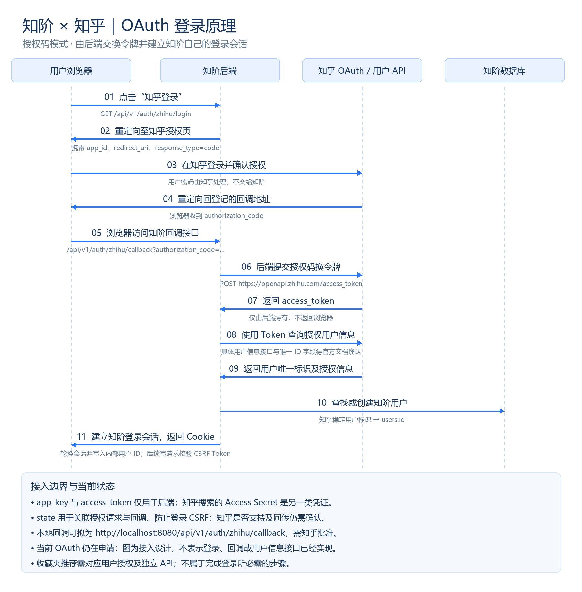

# API 约定

> 六个寻路接口、管理员密码登录、当前用户和退出接口已实现；知乎 OAuth 登录仍待实现。数据库字段见 [数据库设计](DATABASE_DESIGN.md)。

## 一、整体流程

输入目标 → 模型 A 生成节点和依赖 → 后端检查、分层 → 模型 B 生成题目 → 用户作答 → 按答案搜索资料 → 展示全部节点及相应资料。

创建任务后立即返回，后端异步处理。网络和模型调用不能占用一个长数据库事务；每个阶段用短事务保存结果。第一版可用进程内任务执行器，服务重启时将未完成的生成任务标记为失败，提示用户重新创建。

## 二、通用约定

- 业务前缀 `/api/v1`，JSON 编码 UTF-8。时间使用 UTC ISO 8601，例如 `2026-09-08T08:00:00Z`。
- 主键在数据库中为整数，在 JSON 中统一以字符串返回，前端按字符串处理。
- 登录后使用后端会话 Cookie，生产环境设置 HttpOnly、Secure；跨站部署需明确 SameSite、CORS 白名单及 CSRF 防护。写接口验证 CSRF Token。
- `user_id` 来自服务端登录态，禁止前端指定。所有会话、题目和节点接口都检查所属关系；不存在或无权访问统一返回 404。
- 默认不分页：一份任务最多 20 个前置节点，每节点按自评档位最多保存 0/2/3/5 条资料；目标名称去除首尾空白后为 1～100 个字符。这些是项目自己的初版限制。
- 刷新页面可通过任务编号恢复进度。前端每两秒轮询状态，达到 READY、COMPLETED 或 FAILED 时停止。
- 模型输出必须经结构、数量、重复节点和循环依赖检查。搜索无结果不允许编造链接或作者。

## 三、接口清单

六个寻路接口均已实现；健康检查状态见文末。

| 方法 | 路径 | 作用 |
| --- | --- | --- |
| POST | `/api/v1/learning-sessions` | 创建寻路任务 |
| GET | `/api/v1/learning-sessions/{sessionId}` | 查询阶段和进度 |
| GET | `/api/v1/learning-sessions/{sessionId}/questions` | 获取题目及已保存答案 |
| PUT | `/api/v1/learning-sessions/{sessionId}/answers/{questionId}` | 保存或修改答案 |
| POST | `/api/v1/learning-sessions/{sessionId}/complete` | 完成答卷并返回结果 |
| GET | `/api/v1/learning-sessions/{sessionId}/nodes/{nodeId}/resources` | 获取结果节点资料 |

### 1. 创建任务

请求 `POST /api/v1/learning-sessions`：

```json
{ "target": "Transformer" }
```

成功返回 202：

```json
{ "sessionId": "101", "status": "GENERATING_GRAPH" }
```

失败：400 `INVALID_TARGET`（空白、超长或请求体格式错误），401 `UNAUTHORIZED`，403 `CSRF_INVALID`，429 `RATE_LIMITED`。按钮提交期间禁用；重新创建属于新任务。

### 2. 查询任务

请求 `GET /api/v1/learning-sessions/101`，无请求体。成功返回 200：

```json
{
  "sessionId": "101",
  "target": "Transformer",
  "status": "SEARCHING_RESOURCES",
  "progress": { "processedNodes": 4, "totalNodes": 7 },
  "warnings": [],
  "error": null
}
```

进度数表示已处理前置节点数，搜索结束后保留最终计数，未生成节点时 totalNodes 为 0。单节点搜索失败放入 warnings，继续搜索其他节点并最终展示图谱。模型生成失败时本接口仍返回 200，但 status 为 FAILED，error 为错误对象，例如：

```json
{
  "sessionId": "101",
  "target": "Transformer",
  "status": "FAILED",
  "progress": { "processedNodes": 0, "totalNodes": 0 },
  "warnings": [],
  "error": { "code": "GRAPH_GENERATION_FAILED", "message": "前置知识生成失败，请重新创建任务。" }
}
```

失败：401、404。错误不能包含密钥、上游完整响应或服务器堆栈。

### 3. 获取答卷

请求 `GET /api/v1/learning-sessions/101/questions`，无请求体。仅 READY、COMPLETED 可查询。成功返回 200：

```json
{
  "questions": [
    {
      "questionId": "301",
      "nodeId": "201",
      "nodeName": "矩阵运算",
      "questionText": "你了解矩阵乘法吗？",
      "hint": "它会用于理解注意力机制中的计算过程。",
      "options": [
        { "value": "VERY_FAMILIAR", "label": "非常了解" },
        { "value": "BASICALLY_KNOW", "label": "基本了解" },
        { "value": "HEARD_OF", "label": "听说过" },
        { "value": "DONT_KNOW", "label": "不了解" }
      ],
      "answer": null
    }
  ]
}
```

answer 有值时为选项枚举字符串。按 sort_order 排序，目标节点不出题；此接口不返回知乎资料。

失败：401、404、409 `SESSION_NOT_READY`。

### 4. 保存答案

请求 `PUT /api/v1/learning-sessions/101/answers/301`：

```json
{ "answer": "VERY_FAMILIAR" }
```

成功返回 200：

```json
{ "questionId": "301", "masteryStatus": "MASTERED", "answeredCount": 1, "totalQuestions": 7 }
```

只有 VERY_FAMILIAR 映射 MASTERED，其余三项映射 TO_LEARN。答案按 question_id 更新或新增，重复提交不重复计数。答案与节点状态在同一事务更新。

SEARCHING_RESOURCES 期间禁止修改答案，返回 409。允许在 READY、COMPLETED 修改；已完成后保存不同答案会把会话恢复为 READY，清除完成时间，前端重新调用 complete。页面注明“基于你的自评生成”，不是客观能力考试。

失败：400 `INVALID_ANSWER`，401、404、409 `SESSION_NOT_READY`。

### 5. 完成答卷

请求 `POST /api/v1/learning-sessions/101/complete`，无请求体。成功返回 200：

```json
{
  "sessionId": "101",
  "status": "COMPLETED",
  "target": "Transformer",
  "missingCount": 2,
  "nodes": [
    { "id": "204", "name": "Attention", "isTarget": false, "level": 0, "answer": "BASICALLY_KNOW", "resourceLimit": 2 },
    { "id": "205", "name": "Self-Attention", "isTarget": false, "level": 1, "answer": "DONT_KNOW", "resourceLimit": 5 },
    { "id": "208", "name": "Transformer", "isTarget": true, "level": 2, "answer": null, "resourceLimit": 0 }
  ],
  "edges": [
    { "from": "204", "to": "205" },
    { "from": "205", "to": "208" }
  ]
}
```

后端在事务内确认全部题目已回答。有待搜索节点时返回 200、status=SEARCHING_RESOURCES，异步整理后变为 COMPLETED；前端继续轮询会话。无待搜索节点则直接 COMPLETED。missingCount 包含基本了解、听说过和不了解，不包含目标及非常了解。

保留原始全部节点、边及层级，不隐藏或跨接已掌握节点。节点新增 answer（目标为 null）与 resourceLimit（0/2/3/5）字段。全部非常了解时 missingCount=0，仍返回完整图；后端允许没有前置节点直接完成；产品界面对此展示补充目标或重试提示，不作为成功学习路径。

该接口可重复调用以恢复结果，无答案变化时返回相同内容，不重新调用模型或搜索。

失败：401、404、409 `SESSION_NOT_READY` 或 `ANSWERS_INCOMPLETE`；搜索队列满时返回 429 `RATE_LIMITED`。

### 6. 节点资料

请求 `GET /api/v1/learning-sessions/101/nodes/204/resources`，无请求体。仅完成会话中可见的节点可查询。成功返回 200：

```json
{
  "nodeId": "204",
  "nodeName": "Attention",
  "reason": "理解注意力机制有助于学习自注意力结构。",
  "resourceStatus": "EMPTY",
  "resources": []
}
```

每条 resources 包含 id、title、url、summary、authorName、voteCount。实际值来自知乎 API，不捏造示例文章。可缺失字段为 null，不使用 0 冒充未知点赞数。按 sort_order 排序，非常了解 0 条、基本了解最多 2 条、听说过最多 3 条、不了解最多 5 条；不足时返回实际数量，不补造资料。资源状态区分 READY、EMPTY、FAILED；搜索失败时仍返回 200 和空数组，前端显示失败提示。

目标节点与非常了解的节点返回 resourceStatus 为 NOT_APPLICABLE、resources 为空，仍可查看 reason。

失败：401、404、409 `SESSION_NOT_COMPLETED`。

## 四、统一错误响应

业务请求失败使用对应 HTTP 状态码和以下结构：

```json
{ "error": { "code": "ANSWERS_INCOMPLETE", "message": "还有题目未作答，请完成后再查看结果。" } }
```

| 状态码 | 错误码 | 处理方式 |
| --- | --- | --- |
| 400 | INVALID_TARGET / INVALID_ANSWER | 修改输入后重试 |
| 401 | UNAUTHORIZED | 重新登录 |
| 403 | CSRF_INVALID | 刷新页面获取有效令牌 |
| 404 | NOT_FOUND | 对象不存在或不属于当前用户 |
| 409 | SESSION_NOT_READY / SESSION_NOT_COMPLETED / ANSWERS_INCOMPLETE | 按提示等待或完成答卷 |
| 429 | RATE_LIMITED | 稍后重试，遵循 Retry-After |
| 500 | INTERNAL_ERROR | 提示重试，不暴露内部信息 |

## 五、登录与外部服务边界

### 知乎 OAuth 原理图（接入设计）



浏览器负责跳转及用户授权，知阶后端负责交换令牌、查询知乎身份并建立自己的登录会话；数据库用知乎稳定用户标识关联内部 users.id。OAuth 当前仍在申请，图中登录和回调流程尚未实现。

依据已提供的知乎接入说明，授权地址为 `https://openapi.zhihu.com/authorize`；回调参数名为 `authorization_code`。换令牌请求为 `POST https://openapi.zhihu.com/access_token`，使用 `application/x-www-form-urlencoded` 提交 app_id、app_key、grant_type=authorization_code、redirect_uri 及 code（值取自回调的 authorization_code）。app_key 和 access_token 不返回浏览器。

用户信息接口、稳定身份字段、state 参数支持与回传，以及 localhost 回调是否允许，仍需知乎确认。申请公开内容权限后，收藏夹推荐也需单独对接相应接口；不能据此假设能读取私密收藏夹。搜索 Access Secret 与 OAuth 应用凭证、用户令牌用途不同，不能互相替代。

### 当前身份接入与本地调试

管理员登录已接入，前端唯一公开入口为 `/login`，左下角按钮打开账号密码弹窗。首页、答卷、结果和其他路径都受登录保护；Mock 数据模式也需要真实认证。知乎授权按钮目前仅提示申请中，不发起尚未实现的 OAuth 请求。以下两个接口都不要求已有登录身份：

| 方法 | 路径 | 用途 |
| --- | --- | --- |
| GET | `/api/v1/auth/csrf` | 创建匿名会话并获取登录所需的 CSRF Token |
| POST | `/api/v1/auth/admin/login` | 校验管理员密码并建立登录会话 |

先调用 GET，成功 200 返回 `{"csrfToken":"会话绑定的随机令牌"}`。保留 Cookie，再向 POST 提交 `{"username":"admin","password":"用户输入的密码"}`，并在 `X-CSRF-Token` 请求头中携带刚取得的令牌。

登录成功 200 返回 `{"userId":"内部用户ID","csrfToken":"新会话令牌"}`。旧会话失效，Cookie 和 CSRF Token 轮换；后续写请求必须使用新令牌。响应带 `Cache-Control: no-store`。前端只在表单内存中短暂处理密码，不写 URL 或浏览器持久化存储；未登录访问题单或结果页会跳到登录页，并在成功后恢复安全的站内任务地址。

失败：400 `INVALID_LOGIN_REQUEST`（请求体格式错误）、401 `INVALID_CREDENTIALS`（统一提示“账号或密码不正确。”）、403 `CSRF_INVALID`、429 `LOGIN_RATE_LIMITED`（Retry-After: 60）、503 `ADMIN_LOGIN_DISABLED`。单实例全局每个 60 秒窗口最多受理 10 次凭证校验，修改用户名或 Cookie 不重置计数。登录失败不创建用户，也不自动重放登录请求。

管理员登录默认关闭。`admin-local` 配置启用登录且仅监听 127.0.0.1，适合本地 HTTP；`admin-login` 配置启用登录并强制 Secure Cookie，适合 HTTPS 演示站点。任何管理员模式都不能与 local-test 身份旁路同时开启，否则启动失败。启用时必须配置合法用户名和密码哈希；缺少哈希会拒绝启动，没有公共默认密码。

`AuthUserStore.adminUser` 使用 `admin:<username>` 作为内部身份标识写入 users，重复登录复用同一用户。该标识不是知乎用户 ID，也不代表 OAuth 已接入；没有新增表或修改迁移。业务始终按当前 user_id 隔离，管理员无跨用户读取能力。多位成员共用同一管理员账号时，也会共用该账号的任务。

密码格式为 `pbkdf2-sha256$600000$<16字节盐的Base64>$<32字节哈希的Base64>`，使用 PBKDF2-HMAC-SHA256。通过 `backend/scripts/setup-admin-login.ps1` 可生成随机初始密码和被 Git 忽略的本地配置；部署时由平台 Secret 注入用户名和哈希，不传到前端。

`GET /api/v1/auth/me` 已实现，成功返回 `{"userId":"1","csrfToken":"会话绑定的随机令牌"}`；没有登录会话返回 401（local-test 自动测试身份除外）。管理员登录成功后可查询此接口，OAuth 回调仍未实现。

认证代码集中在 `com.zhihu.hackathon.auth` 模块（Java 包，尚未拆成独立 Maven 工程），不依赖学习任务模块。`CurrentUserProvider` 是业务读取身份的入口；`AuthUserStore` 隔离用户存储，`SessionAuthentication` 负责会话生命周期，`CsrfTokens` 负责写请求校验，`AuthException` 及其处理器统一返回认证错误。

普通配置从服务器会话的 `knowledgeSteps.userId` 读取内部用户 ID，并确认该用户仍存在且不是 local-test: 测试身份。OAuth 后续完成授权验证、令牌交换、用户信息查询和用户落库后，再调用 `SessionAuthentication.establish`：旧会话失效，新会话与 CSRF 令牌重新生成，避免沿用登录前会话。该方法不对浏览器提供设置用户 ID 的接口。

local-test 配置创建固定测试用户，每个进程第一次读取身份时初始化一次，后续轮询不重复写 users 表。名称由服务器配置 `learning.local-user` 决定（默认 developer），不能从请求头或参数切换。此模式仍是开发身份旁路，禁止在正式环境启用。

`GET /api/v1/auth/me` 的成功和认证失败响应包含 `Cache-Control: no-store`。会话空闲超时 30 分钟，只接受 Cookie 会话跟踪，Cookie 设置 HttpOnly、SameSite=Lax；本地 HTTP 默认 Secure=false，生产 HTTPS 必须设置 `SESSION_COOKIE_SECURE=true`。

`POST /api/v1/auth/logout` 已实现：携带会话 Cookie 和 X-CSRF-Token，无请求体；成功返回 204，无响应体并使服务器会话失效。未登录返回 401，CSRF 校验失败返回 403，错误结构与其他认证接口一致。local-test 下退出只销毁当前 Cookie 会话，再次访问 auth/me 仍会按固定测试身份创建新会话；正式登录不会自动恢复身份。

Apifox 调试顺序：

1. 在 backend 目录启用 local-test 启动后端，默认端口 8080。
2. GET `/api/v1/auth/me`，保留 Cookie，复制响应中的 csrfToken。
3. POST `/api/v1/learning-sessions`，Headers 添加 `X-CSRF-Token`，JSON 为 `{"target":"Transformer"}`。
4. 每两秒 GET `/api/v1/learning-sessions/{sessionId}`；到 READY 或 FAILED 停止。READY 表示节点、依赖、资料状态和完整题目已保存，随后可继续调用答卷读取、答案保存、完成答卷和节点资料接口。

缺少或错误 CSRF 令牌：403 `{"error":{"code":"CSRF_INVALID","message":"请刷新页面获取有效令牌。"}}`。跨用户访问或非法任务编号：404 `{"error":{"code":"NOT_FOUND","message":"任务不存在。"}}`。额外 userId 字段不参与身份判断。

当前默认使用四个工作线程（可通过 GENERATION_WORKERS 调整，范围 1–32）、最多八个排队任务；队列已满时在创建记录之前返回 429 `{"error":{"code":"RATE_LIMITED","message":"生成任务繁忙，请稍后重试。"}}`，响应头 Retry-After: 5。此限制是单实例全局容量控制，尚未实现每用户时间窗口限流。

### 生成职责划分

GraphGenerator、QuestionGenerator、ResourceSearch 为上游端口，SessionStore 为存储端口；GenerationPipeline 负责步骤编排，GraphValidator 只做纯数据校验。默认使用硅基流动实现两个模型端口，读取 model.graph-model 和 model.question-model；网络请求与数据库短事务分离。更换供应商不需要修改 Controller 或 JDBC 存储。

模型 A 输出 `{"targetDescription":"目标的具体介绍与核心特点","nodes":[{"key":"n1","name":"矩阵运算","description":"用途"}],"edges":[{"from":"n1","to":"target"}]}`；nodes 仅含前置节点，目标由后端加入。拒绝超量、规范化重名、未知引用、重复边、自环、循环、目标出边和无法到达目标的节点，按最长依赖路径分层。

模型 B 输出 `{"questions":[{"nodeId":"数据库节点ID","questionText":"自评问题","hint":"用途"}]}`，必须恰好覆盖全部前置节点。空前置图跳过搜索与模型 B，保存目标后进入 READY。搜索失败的 warnings 元素为 `{"nodeId":"节点ID","code":"RESOURCE_SEARCH_FAILED","message":"该节点资料搜索失败。"}`。

模型使用 JSON Object 模式，不保证上游严格遵循 JSON Schema；本地忽略契约外字段，修复尾逗号等可恢复格式并补齐可选空值；拒绝重复 JSON 属性、尾随数据、截断和非法结构，语义质量仍需人工验收。生成内容校验失败时，每阶段自动纠正一次并重新校验；正常成功不增加请求，HTTP/鉴权/超时/响应信封失败不重试。纠正仍失败时，错误按本文“AI 生成失败分类”返回。重启时中断的图谱/问卷生成标记 FAILED / GENERATION_INTERRUPTED；完整答卷的搜索中任务恢复 READY，保留已处理资料。

2026-09-09 验证：Java 21 完整 verify 的 49 项测试全部通过；独立测试库中真实 Transformer 任务到达 READY，保存 10 个前置节点、1 个目标、10 条依赖、30 条知乎资料及10道自评题，warnings 为空，外键检查无错误。该结果验证生成链路，不表示 OAuth 已完成，也不替代前端真实接口联调。

OAuth 尚待实现的接口为 `GET /api/v1/auth/zhihu/login`（跳转授权）和 `GET /api/v1/auth/zhihu/callback`（校验授权响应、换取身份、建立会话）。除 app_id/app_key 外，还需确认用户信息接口、稳定 ID 字段、state 回传及回调白名单；接入时应实现授权事务有效期、一次性消费与拒绝重复回调、上游超时和错误脱敏。PKCE 是否可用需官方确认，不能假定支持。返回站内页面应使用固定或白名单地址，不接受任意跳转 URL。

2026-09-11 管理员登录回归：Java 21 完整 verify 共 81 项测试全部通过，覆盖密码验证、尝试限流、会话与 CSRF 轮换、任务归属、退出失效，以及管理员与 local-test 配置冲突（包括关闭登录开关的覆盖场景）。前端 lint、typecheck、build 通过；隔离数据库中真实 HTTP 验证登录与退出，浏览器验证错误提示、登录后返回原任务、完成任务和退出。`admin-login` 实际响应已确认包含 Secure、HttpOnly、SameSite=Lax Cookie。验收未调用模型或知乎，不表示 OAuth 授权码交换或实际 HTTPS 部署已经完成。

模型 A 输入目标，输出稳定临时节点标识、名称、描述、依赖边；由后端分配数据库 ID。模型 B 输入已校验节点及数据库 ID，为每个前置节点输出一道题目和提示。后端校验题目覆盖完整且不重复。

知乎搜索在后端执行，每个前置节点独立请求、限并发、超时控制，限次重试；返回结果以 node_id 绑定并缓存。先生成答卷，全部答案保存并提交 complete 后才按自评档位搜索，目标和非常了解节点不搜索。具体上游参数和额度以赛事官方文档为准。

已根据团队提供的接口说明添加 `ZhihuSearchClient`，已接入生成流程，并已通过真实请求验证：GET `https://developer.zhihu.com/api/v1/content/zhihu_search`，Query 和 Count 参数区分大小写，客户端请求 Count=3；发送 Bearer 凭证、秒级 X-Request-Timestamp 和 application/json。凭证读取后端 `ZHIHU_ACCESS_SECRET`。响应 Code=0 时读取 Data.Items，将 Title、Url、ContentText、AuthorName、VoteUpCount 映射到资料字段，保留 Url 的 UTM 参数；缺失赞同数返回 null。空数组表示无结果，结构异常或上游错误不能当作空搜索成功。

客户端连接超时 5 秒、读取超时 15 秒，不跟随重定向，不在异常中携带上游正文或凭证。生成任务串行执行，每个前置节点最多搜索两次（只有可重试错误才重试，间隔1秒），结果按节点持久化；单节点最终失败保存 FAILED，继续处理其他节点并最终展示图谱，不建立跨用户缓存。

每个接口改动都要在 PR 中更新本文件，并提供请求、成功响应和失败响应示例。

## 当前基础接口

### 本地上游测试接口（已实现）

仅启用 `local-test` 配置时开放，默认仅监听 127.0.0.1。无需登录，不用于部署或正式业务；不写入业务数据，不自动重试。凭证读取 `backend/secrets.properties`，不通过请求传入。

在 backend 目录启动：

```powershell
.\mvnw.cmd spring-boot:run "-Dspring-boot.run.profiles=local-test"
```

IDEA 也可仅为本地测试把有效配置文件设为 `local-test`（不是目录），工作目录仍为 `$PROJECT_DIR$/backend`。普通启动保持有效配置文件为空，不注册这两个接口。

| 方法 | 路径 | 请求 | 成功响应 |
| --- | --- | --- | --- |
| GET | `/api/test/zhihu/search?query=Transformer` | query 去空白后 1～100 字符 | `{"resources":[...]}`，最多 3 条真实资料，字段为 title、url、summary、authorName、voteCount |
| POST | `/api/test/ai` | `{"prompt":"用一句话解释 Transformer"}`，prompt 去空白后 1～2000 字符 | `{"model":"deepseek-ai/DeepSeek-V4-Flash","content":"模型实际生成的文本"}` |

AI 使用 model.base-url、model.api-key 和 model.graph-model；图谱默认使用 DeepSeek V4 Flash（enable_thinking=false），问卷默认使用 Qwen/Qwen3-30B-A3B-Instruct-2507。测试接口跟随图谱模型并关闭思考。非流式调用 `/chat/completions`，最大输出 1024 Token，读取超时 60 秒。此接口只测试文本生成，不承诺业务 JSON 结构。返回达到长度上限时报告 AI_OUTPUT_TRUNCATED。

失败响应示例：400 `{"error":{"code":"INVALID_INPUT"}}`；缺失密钥返回 503；上游失败返回 502 和脱敏代码（例如 AI_UPSTREAM_HTTP_401、AI_REQUEST_FAILED、ZHIHU_AUTH_FAILED），不返回上游错误正文。

2026-09-08 实测：Java 21 完整 verify 通过，现有 12 项测试全部通过；独立测试数据库下，知乎测试接口 HTTP 200 返回 3 条资料，硅基流动测试接口 HTTP 200 返回非空文本；空 prompt、空 query 均返回 400。未修改实际业务数据库。

| 接口 | 用途 | 状态 |
| --- | --- | --- |
| `GET /actuator/health` | 部署后健康检查 | 已实现 |

## 数据边界

- 知乎 OAuth Token、Access Secret 和模型密钥只在后端环境变量中使用，不能返回给浏览器。
- 查询学习记录必须同时使用当前用户标识和记录 ID；不能只按记录 ID 查询。
- 未完成 OAuth 接入前，不得用开发者账户的数据冒充登录用户的数据。

登录用户资料：`GET /api/v1/auth/me` 与管理员登录成功响应在 `userId`、`csrfToken` 外增加 `nickname`、`avatarUrl`。资料读取自当前登录用户的 users 记录；无头像返回空字符串，前端使用默认头像，昵称缺失显示“用户”。

目标描述由模型 A 的 `targetDescription` 提供（提示词要求非空且最多 1000 字符，兼容修复允许缺失或 null 补为空字符串），保存至目标节点的 description，通过节点资料接口的 reason 展示。目标仍不参与答题或搜索。新规则仅适用于新生成任务；历史任务的固定描述不会自动重新生成。


### AI 生成失败分类

会话状态仍为 `FAILED`，通过 `error.code` 区分原因，前端失败弹窗直接展示对应 `error.message`：

| 错误码 | 含义 |
| --- | --- |
| MODEL_REQUEST_TIMEOUT | 请求连接或读取超时，或上游返回 HTTP 408/504 |
| MODEL_JSON_PARSE_ERROR | 上游响应 JSON 或模型输出 JSON 解析、类型映射失败 |
| MODEL_INVALID_RESPONSE | 内容被截断、缺失或响应格式异常 |
| GRAPH_VALIDATION_FAILED | JSON 能读取，但图谱名称缺失、存在重复节点、环或不可达等结构问题 |
| QUESTION_VALIDATION_FAILED | 问卷数量、节点覆盖或字段内容不符合约束 |
| MODEL_GENERATION_FAILED | 其他模型调用失败，如非超时的 HTTP 错误或连接异常 |

两次模型调用均保留超时和 JSON 错误分类。返回信息不包含供应商响应正文、密钥或提示词。历史失败任务保留原错误码，重启后端后新建任务使用新分类。


模型速度配置：业务图谱请求显式传入 `enable_thinking: false`（[硅基流动说明](https://www.siliconflow.com/blog/deepseek-v4-now-on-siliconflow-million-token-context-intelligence)）；问卷使用非思考 Instruct 模型，不额外传入思考开关。两次调用均保留 JSON 输出、8192 token 上限及现有 60 秒读取超时。配置在 backend/secrets.properties，示例配置同步更新；重启后端生效。具体延迟与账户模型可用性仍需真实接口验证。


AI 响应入库前经过两阶段校验修复，详见 [AI JSON 校验与修复](AI_JSON_VALIDATION.md)。提示词仍要求完整字段；兼容修复层允许缺失的节点描述和目标描述补为空字符串，关键名称、关系及题干仍须通过业务校验。


### 提交前清空选择

答题时的选择暂存于当前页面，点击“清空所有选择”将本轮全部选项恢复为未选择，并重置进度和侧栏。清空不调用后端接口，不删除已提交数据。点击“查看结果”时，前端通过现有 PUT 答案接口保存本轮全部答案，全部成功后再调用 complete；保存失败保留页面选择供重试。未提交选择不会在刷新后保留。

## 历史寻路

`GET /api/v1/learning-sessions?page=1`：需要登录，只查询服务端当前用户的记录，不接受客户端指定用户身份。按记录 ID 倒序，每页 20 条；page 范围 1–1000000。

返回 `total`、`page`、`pageSize` 和 `items`，每项包含字符串 `sessionId`、`target`、`status`、`createdAt` 和可空的 `targetDescription`（本次寻路根节点的原始描述）。总数包含生成中、已完成和失败记录；没有记录时返回空数组。响应禁止缓存，不新增数据库表。

新建寻路的 sessionId 为雪花 ID 的十进制字符串。客户端不得转换为 JavaScript Number；路由、请求和响应均保持字符串。历史自增 ID 仍然可读，无需更换已有链接。

资料项新增可空 contentDate，格式 YYYY-MM-DD。来源为知乎搜索 EditTime，表示发布时间或更新时间，按 Asia/Shanghai 转为日期。缺失或非法值返回 null；不使用抓取时间替代。

## 硬删除历史寻路

`DELETE /api/v1/learning-sessions/{sessionId}`：需要登录和 `X-CSRF-Token`，仅允许删除当前用户自己的记录。成功返回 `200 {"deleted":true}`；不存在或不属于当前用户返回 404。

同事务删除 assessment_answers、assessment_questions、node_resources、knowledge_edges、knowledge_nodes 和 learning_sessions 关联记录；失败全部回滚。用户账号和雪花生成状态保留。生成中同样可删除，后台迟到的图谱、问卷或搜索结果不得重新写入或污染复用的节点 ID。已发送的外部请求可能继续执行，但不会恢复删除的数据。


### 创建寻路的用户限制

身份来自已验证的登录会话（包括正式 OAuth 登录对应的内部用户），不接受请求体传入的 userId。每用户滚动 60 秒内最多成功创建 10 条寻路；第 11 条返回 HTTP 429，错误码 `USER_CREATE_RATE_LIMITED`，`Retry-After` 为本窗口剩余秒数。参数错误、历史满额、队列拒绝不新增创建计数。

每用户最多保留 20 条寻路，所有状态均计入，包括失败和生成中的任务。满额返回 HTTP 409、`SESSION_LIMIT_REACHED`，提示前往历史寻路删除记录。已有超过 20 条的历史不自动删除，需删到少于 20 条才能再次创建。其他用户的记录不会计入。

删除只释放历史名额，不重置创建速率。V6 增加独立的短期创建计数表，不关联寻路内容或 session ID，创建时清理已过期记录；与寻路插入同事务提交，重启保留当前窗口，并发请求不能突破名额。此表不是寻路内容备份，不影响历史内容的硬删除语义。该策略不是每日 API 预算限制。


### 用户在途任务和幂等创建

单实例下，每用户最多 2 个实际执行或排队的后台任务（图谱/问卷生成和资料搜索合计）。问卷 READY 后等待用户作答不占名额。超限返回 429 `USER_TASK_LIMIT_REACHED`；删除历史不提前释放正在运行的任务名额，任务退出（包括失败）后释放。应用重启时原任务按既有规则恢复为中断状态。

POST 创建支持 `Idempotency-Key` 请求头，8–128 个 ASCII 字母、数字或 `._:-`。新前端自动提供 UUID：一次提交发生网络异常后重试沿用原标识，同时用同步锁防止双击。未提供该头的旧客户端仍可创建，但没有幂等保证。

同用户、同标识、同目标在 24 小时内返回原 sessionId 和当前状态（HTTP 202），不再执行生成，也不重复计入速率、历史或在途配额。相同标识换目标返回 409 `IDEMPOTENCY_CONFLICT`；原记录已删除返回 410 `IDEMPOTENCY_DELETED`，前端下一次点击使用新标识。不同用户标识互不影响。幂等回放先于容量限制检查，满额时仍能取回原请求结果。V7 凭据保存目标 SHA-256、用户、请求标识及时间，删除后 session_id 置空，后续创建清理过期凭据，不保存目标原文。

模型 HTTP 429 每次调用至多重试 2 次：默认 1 秒、2 秒指数退避，另加 250–750 毫秒随机延迟；尊重上游 Retry-After 秒数或 HTTP 日期。若要求等待超过 30 秒，直接返回模型繁忙，不提前重试。仍被限流时任务记录 `MODEL_RATE_LIMITED`，不无限重试。401、其他非 429 错误不因本规则重试，线程中断终止等待。原图谱/问卷校验修复最多一次的规则仍独立存在，每个修复调用也适用上述上限。
