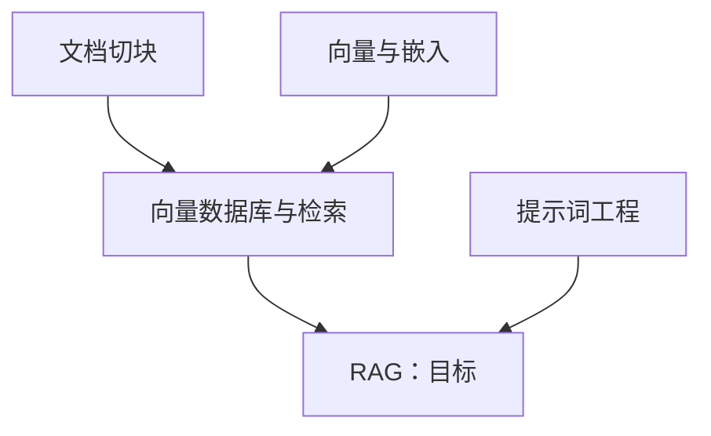

# 知阶 KnowledgeSteps 前端建设规划书

编制日期：2026-09-10。适用范围：当前仓库前端从 Mock 演示版本推进到首版真实业务交付。

本规划依据产品文档、接口约定和现有源码编制。现状判断来自静态检查，不代表已完成浏览器交互验收、性能测量或真实接口联调。本文中的新增模块、测试工具、工期和发布条件均为后续实施计划。

## 一、规划结论与文档关系

项目已经具备 React 页面、问答交互、Mock 会话和资料侧栏，适合在现有工程上迭代。首版工作重心是补齐问答闭环、正确展示知识依赖、接入真实接口并建立交付验证；沿用当前品牌与页面结构。

| 文档 | 职责 |
| --- | --- |
| [PROJECT.md](PROJECT.md) | 产品定位、用户和首版范围 |
| [API_CONTRACT.md](API_CONTRACT.md) | 接口字段、权限及业务状态的约定 |
| [FRONTEND.md](FRONTEND.md) | 前端技术方案与模块说明 |
| [UI_DESIGN.md](UI_DESIGN.md) | 已有视觉、组件和交互规范 |
| 本文 | 当前差距、实施决策、工作拆分、依赖和验收标准 |
| [DEPLOYMENT.md](DEPLOYMENT.md) | 部署平台、环境配置与发布流程 |

发生冲突时，产品范围以 PROJECT 为准，接口语义以 API_CONTRACT 为准；实现现状以源码为准。实施时同步更新对应文档，不能把本文中的建议当作已经存在的接口或功能。

## 二、现状盘点

### 2.1 已具备的基础

| 范围 | 当前实现及依据 | 规划处理 |
| --- | --- | --- |
| 工程 | [package.json](../frontend/package.json)：React、TypeScript、Vite、Ant Design `^6.6.3`、React Router `^7.18.3` | 沿用框架，按现有锁文件核定依赖版本 |
| 页面与路由 | [App.tsx](../frontend/src/App.tsx)：首页、问答页、结果页及 404，业务页面懒加载 | 保持三个业务页面，生成等待作为问答页内视图 |
| 首页 | [HomePage.tsx](../frontend/src/pages/HomePage.tsx)：目标校验、热门主题回填、创建反馈 | 完善重复提交防护、失败恢复和真实模式文案 |
| 问答 | [SessionQuestionsPage.tsx](../frontend/src/pages/SessionQuestionsPage.tsx)：读取题目、保存后前进、状态侧栏、完成入口 | 补齐全答完后的修改和零题目流程 |
| 结果 | [SessionResultPage.tsx](../frontend/src/pages/SessionResultPage.tsx)：状态门禁、重复调用 complete 恢复结果 | 保留恢复方式，补充数据失效与错误恢复 |
| Mock | [store.ts](../frontend/src/api/mock/store.ts)：阶段模拟、答案更新、隐藏节点、localStorage 保存 | 保留为开发演示与测试工具，生产数据不依赖此存储 |
| 视觉 | [styles.css](../frontend/src/styles.css)、[main.tsx](../frontend/src/main.tsx)：品牌变量、中文组件主题、980/700px 断点、焦点与减弱动效 | 优先保证一致性、阅读和操作反馈 |
| 开发与 CI | [vite.config.ts](../frontend/vite.config.ts) 已有 `/api` 代理；[ci.yml](../.github/workflows/ci.yml) 已有 lint、类型检查和构建 | 扩展业务测试与发布后的页面检查 |

### 2.2 优先差距

P0 表示首版交付必须解决；P1 表示核心流程稳定后的体验与维护优化；P2 表示首版之外的评估项。

| 编号 | 优先级 | 已核实的现状 | 影响与实施方向 |
| --- | --- | --- | --- |
| G01 | P0 | [sessions.ts](../frontend/src/api/sessions.ts) 的六个函数全部直接调用 Mock store | 页面不能访问真实任务；增加统一 HTTP 层和显式数据模式 |
| G02 | P0 | 问答页只要 `allAnswered` 为真就渲染完成面板；侧栏跳题仅改变 `currentIndex` | 全答完及结果页返回后无法打开选项修改；增加独立的复核/编辑视图状态 |
| G03 | P0 | 问答页将空数组与尚未加载一起处理，`allAnswered` 要求题数大于零 | 后端合法返回零道题时持续加载；空数组显示“无需自评”，允许调用 complete |
| G04 | P0 | [PathView.tsx](../frontend/src/components/result/PathView.tsx) 仅按 level 分组并在层间画统一箭头，未消费 `result.edges` | 多分支和跨层依赖表达不准确；按真实边绘制连线，提供依赖文字列表 |
| G05 | P0 | PathView 在零缺口时只返回说明区，没有可操作的目标节点 | 与产品“只展示目标”要求有差距；保留目标入口并展示不搜索目标资料的说明 |
| G06 | P0 | [useSession.ts](../frontend/src/hooks/useSession.ts) 正常轮询间隔为 1100ms，错误重试为 1800ms，只有 404 会停止错误重试 | 不符合两秒轮询约定；补终态、401/403、限流、网络恢复和取消策略 |
| G07 | P0 | [ResourcesDrawer.tsx](../frontend/src/components/result/ResourcesDrawer.tsx) 固定展示 Mock 文案，未展示返回的作者与赞同数 | 切换真实接口后仍会误导；按模式与真实可空字段渲染，补请求重试入口 |
| G08 | P0 | API 文档标明六个业务接口待实现；后端现有控制器提供的是 `/api/test` 本地上游测试 | 上游可连通不等于业务可联调；真实交付依赖会话、问卷、结果、权限接口完成 |
| G09 | P0 | 登录与 CSRF 只有设计约定；仓库没有 Vercel SPA fallback 配置文件 | 真实写请求和子路由刷新无法据此保证；与后端落实认证、令牌下发及部署路由 |
| G10 | P0 | package scripts 与 CI 没有前端行为测试 | 构建通过不能覆盖改答案、空问卷、边连接等问题；为关键路径建立自动化验证 |
| G11 | P1 | Mock 的结果分层取自原始图，未基于精简后的图重新计算 | 与 complete 的重新分层约定有偏差；修正演示模型并用契约样例验证 |

### 2.3 文档需要校准的地方

FRONTEND 的选型表写 Ant Design v5，依赖章节与 package.json 已是 v6；轮询、完成后的改答案、真实依赖连线等描述也不能全部视作已实现。实施第一阶段需标明“已实现 / 待实现”，避免以文档描述替代验收。

UI_DESIGN 引用的根目录 `.impeccable.md` 当前不存在；设计背景可先引用 PROJECT 与 UI_DESIGN，不应继续依赖失效链接。其“大面积不使用纯白”与 `--bg-card: #ffffff` 的表述需要统一；本期先沿用现有 token，不以此触发整站视觉重做。

## 三、产品目标与范围

### 3.1 面向谁、解决什么问题

面向不清楚新知识前置要求的学生与自主学习者。用户输入一个学习目标，通过逐题自评，得到需要补齐的知识及对应资料。成功标准是用户能理解“缺什么、先学什么、到哪里学”，并能修改判断重新获得结果。

首版选择 Transformer、RAG、Spring Boot 作为重点验收主题，与现有专用 Mock 图一致。首页的“线性代数”目前走通用 Mock 模板，不能据此宣称已有专门知识结构；正式保留快捷入口前需验证真实生成质量。热门入口本期采用前端配置清单，不新增配置管理后台。

### 3.2 首版交付范围

1. 首页：目标输入、校验、示例回填、创建任务和失败恢复。
2. 问答页：生成状态、自评、保存反馈、上一题、复核修改和刷新恢复。
3. 结果页：准确的缺口数量、可见节点及依赖关系、返回修改、重新寻路。
4. 资料侧栏：节点关联说明、最多三条知乎资料、空态和失败态、原文入口。
5. 真实模式基础：登录态接入、CSRF、权限错误处理、深链接恢复和部署验证。

沿用产品边界：目标节点不出题、不搜索目标资料；已掌握节点只隐藏；缺口数量不含目标。首版不增加打卡、排行榜、学习时长、个人 Dashboard、历史管理、图编辑或能力评分。

认证作为流程前置条件，通过首页/导航中的登录入口和后端回调衔接，不额外扩展账号中心。登录接口未完成时可交付明确标注的 Mock 演示，真实业务发布仍须通过认证验收。

## 四、页面与交互规划

### 4.1 页面入口

| 地址或容器 | 内容和主操作 | 恢复与退出 |
| --- | --- | --- |
| `/` | 输入目标 → 开始寻路 | 创建失败保留输入；热门主题只回填，不自动发请求 |
| `/sessions/:sessionId/questions` | 生成等待 → 自评 → 复核 → 查看结果 | 刷新读取已保存答案；允许从结果页返回编辑 |
| `/sessions/:sessionId/result` | 结果摘要 → 依赖图 → 节点资料 | 未完成时回问答；完成时恢复结果；可重新寻路 |
| 资料 Drawer | 节点说明与资料 | 关闭后回到原节点，保留结果页位置 |
| 未知路径或不可访问任务 | 清晰说明和返回首页入口 | 任务 404 统一表述为“不存在或无权访问” |

URL 中的 sessionId 只标识任务，不是公开分享凭证；转发地址不会授予访问权限。

### 4.2 首页

保留现有品牌、核心承诺、输入框和流程示意，优先让用户看到输入入口。下方说明与装饰不应挤压窄屏首屏操作区；静态演示图需要与用户实际任务结果区分。

- 输入去除首尾空白后为 1～100 字符；前后端统一字符计数口径，覆盖中文、emoji 和粘贴输入。
- 输入框关联错误说明；支持 Enter，提交函数与按钮共同防止重复创建。
- 创建成功拿到 sessionId 才进入问答路由；失败保留原目标，429 遵循服务端 Retry-After。
- 生成失败后的“重新寻路”携带原目标回到首页，由用户确认后创建新任务。
- 首页与等待页的“几秒完成”、资料数量等陈述只展示有依据的内容；真实耗时未测量前不承诺固定完成时间。

### 4.3 生成等待

按 `GENERATING_GRAPH → SEARCHING_RESOURCES → GENERATING_QUESTIONS` 展示“推导前置知识 → 检索学习资料 → 生成自评问卷”。只有搜索阶段且 `totalNodes > 0` 时显示 `processedNodes / totalNodes`，不将它包装成整体成功率或能力分数。

建议等待超过 30 秒显示“仍在处理中，你可以稍后回来查看”；这是交互提示阈值，不是业务超时判定。网络断开保留最近阶段，允许恢复查询。只有服务端报告 FAILED 才显示任务生成失败。

单节点检索失败属于 warning，不能中断答卷；在结果页简洁提示部分资料暂不可用。没有取消接口，因此离开页面只停止浏览器轮询，不承诺终止后台任务。

### 4.4 自评与复核

沿用四个选项：“非常了解 / 基本了解 / 听说过 / 不了解”。按接口返回的题目数组顺序展示，当前契约没有向前端暴露 `sortOrder` 字段，不在页面另行排序。

选中后进入保存中，成功才更新答案并前进，失败停留本题且保留原已保存答案。保存期间锁定答题及跳题操作，避免旧请求完成后把用户跳回其他题目。题目选项使用返回的 `options`，集中维护固定枚举的展示映射。

将“是否全部已答”和“当前是否正在编辑题目”分开：全部已答后默认显示复核面板，点击侧栏任意已答题仍可打开 QuestionPanel；改完后回到复核并手动点击“查看结果”。不能用 `allAnswered` 单独决定是否隐藏题目。

首次进入未完成问卷定位首个未答题；完成后返回问答页进入复核。零题目与加载中分开表示，显示“当前目标无需前置自评”，提供“查看结果”，由 complete 返回最终目标节点。

### 4.5 结果与知识路径

摘要使用服务端的 missingCount，区分待补齐节点与最终目标。保留“基于你的自评生成”的说明，不推导能力等级。

图形使用 `level` 决定分层位置，使用 `edges` 决定连接关系。最多 20 个前置节点加 1 个目标，共 21 个节点。首版采用 HTML 按钮节点配 SVG 连线；根据节点实际尺寸定位端点，窗口变化和长名称换行后重新布局。连线不遮挡点击，按 ID 稳定排序同层节点以减少跳动。

以下示例包含并行和跨层关系；图中没有的边不得由页面补画：



小屏保留阅读依赖的能力：图容器允许局部横向滚动，提供“按依赖查看”文字列表，逐项写明“先学习哪些节点”。列表关系同样来自 edges，不能把所有节点列成单链。

零缺口显示“可以开始学习目标知识”和目标节点；目标入口显示目标说明，避免使用“查看学习资料”暗示存在目标文章。遇到悬空边、重复 ID 或无法布局的数据，给出可恢复提示与已校验节点列表，不展示未经确认的依赖。

### 4.6 资料侧栏

| 状态 | 展示与操作 |
| --- | --- |
| 请求中 | 节点标题、加载反馈；不保留上一个节点的正文 |
| READY | 最多三条资料的标题、摘要、作者、赞同数与“阅读知乎原文” |
| EMPTY | “暂时没有找到合适资料”，仍展示 reason 说明 |
| FAILED | “资料检索暂不可用”，不影响知识路径，也不冒充 EMPTY |
| NOT_APPLICABLE | 目标说明及“当前版本未为目标检索资料” |
| 请求失败 | 就地“重新加载”，按会话权限和完成状态处理 401/404/409 |

接口当前提供 `reason`，未提供独立的节点 `description`。首版据此展示“学习它的原因”；若需要独立“知识简介”，由前后端先补充契约字段，前端不从 Mock 描述或模型调用自行拼出。

作者、摘要、赞同数为 null 时隐藏对应项或标记“未提供”，真实赞同数 0 正常展示。外链校验为有效 HTTP(S) 地址，保留查询参数，使用新标签页和 `noopener noreferrer`；摘要按文本显示，避免直接注入上游 HTML。

“重新加载”只重新读取资料接口，不能承诺重新搜索知乎，因为当前契约没有重新检索接口。快速切换节点时取消或忽略旧请求，缓存键至少包含 sessionId 与 nodeId；修改答案、退出登录及切换用户时使相关缓存失效。

## 五、状态与数据方案

### 5.1 状态权威与路由门禁

服务端拥有任务、答案、结果和权限的最终状态。页面只维护当前题号、复核视图、输入、提交状态、抽屉和短期数据缓存；生产模式不把 Mock localStorage 当作业务记录。

| 会话状态 | 问答路由 | 结果路由 | 轮询 |
| --- | --- | --- | --- |
| 三个生成阶段 | 等待视图 | 回问答路由展示等待 | 持续 |
| READY | 获取题目和已保存答案 | 回问答页，提示先完成答卷 | 停止 |
| COMPLETED | 可进入复核并修改 | 调用 complete 恢复结果 | 停止 |
| FAILED | 失败说明、带原目标重新寻路 | 同左 | 停止 |

结果页不能因为直达路由就自动完成一个 READY 会话。问答路由遇到 COMPLETED 也不能无条件跳走，否则会阻断“修改基础判断”。

### 5.2 轮询与错误恢复

统一正常轮询间隔为 2000ms；上一请求完成后再安排下一次，避免重叠。sessionId 变化时重置页面数据并取消旧请求；组件卸载、重试和 StrictMode 重挂载时清理定时器。采用 AbortController 与请求代次检查，防止旧响应覆盖新任务。

| 情况 | 处理策略 |
| --- | --- |
| HTTP 200 + FAILED | 读取业务错误并停止轮询 |
| 401 | 停止自动请求，提示登录；只保存站内返回路径 |
| 403 CSRF_INVALID | 按后端确定的机制重新获取令牌并让用户重试；未定义机制前不自动重放写请求 |
| 404 | 停止轮询，展示不存在或无权访问 |
| 409 | 重新读取会话，根据未就绪、未完成或答案缺失返回对应视图 |
| 429 | 按 Retry-After 等待；无有效值时使用受限退避 |
| 网络错误或可重试 5xx | 建议 2/4/8 秒有限重试，之后保留状态并提供手动重试 |

自动重试默认用于读取请求。创建任务不自动重放，避免产生重复任务；保存答案失败保留当前题，供用户重新提交。complete 虽支持幂等恢复，仍须与答案修改串行，不能读取并展示旧版本结果。

### 5.3 答案修改与恢复

保存答案成功后采用 `masteryStatus`、`answeredCount` 和 `totalQuestions` 校准界面；刷新时根据已保存 answer 和契约固定映射恢复分组。前端不自行剪枝、计算缺口或重新评分。

在 COMPLETED 后修改答案，立即作废本地结果及资料缓存，重新读取会话进入 READY。再次完成后使用新结果；如果只是查看旧答案未保存，则不主动变更服务端完成状态。

返回页面、窗口重新获得焦点和收到会话冲突时做一次状态校验，减少另一标签页改答案后继续展示旧结果。首版无需实时协同，但应保证不同任务的数据不会串用。

## 六、工程与接口实施方案

### 6.1 技术选择

保留 React + TypeScript + Vite、React Router 和当前 Ant Design v6。Ant Design 继续负责主题、反馈、Drawer 等基础能力，品牌页面复用现有 CSS。当前规模暂不引入 Redux、图编辑器或完整设计系统重构。

保持 `api/sessions.ts` 作为页面调用入口，新增以下职责；文件名是建议，实施时以减少重复为准：

| 建议模块 | 职责 |
| --- | --- |
| `src/api/http.ts` | fetch、JSON 解析、Cookie、CSRF、错误映射、取消与超时 |
| `src/api/config.ts` | 校验数据模式和 API 基础地址 |
| `src/api/real/sessions.ts` | 六个业务接口的真实实现 |
| `src/hooks/useQuestions.ts` | 问卷加载、保存、复核与操作串行 |
| `src/hooks/useNodeResources.ts` | 资料加载、缓存、切换取消和重试 |
| `src/utils/graphLayout.ts` | 可见图校验、节点位置与边端点计算 |
| `src/components/feedback/` | 复用加载、失败和不可访问提示 |
| `src/api/__tests__/`、`src/hooks/__tests__/`、`e2e/` | 契约适配、状态恢复及用户流程测试 |

接口类型继续集中于 `api/types.ts`。页面处理路由与页面状态，业务 Hook 处理异步数据，展示组件接收数据与事件。样式按实际改动逐步整理，避免为了目录结构大范围搬迁已有页面。

### 6.2 接口映射与联调顺序

六个接口目前均为契约设计，真实实现仍依赖后端。

| 顺序 | 方法与路径 | 前端交付重点 |
| --- | --- | --- |
| 1 | `POST /api/v1/learning-sessions` | 202、字符串 sessionId、校验、重复创建防护 |
| 2 | `GET /api/v1/learning-sessions/{id}` | 生成阶段、warnings、FAILED、权限和两秒轮询 |
| 3 | `GET /api/v1/learning-sessions/{id}/questions` | 数组顺序、已保存答案、零题目 |
| 4 | `PUT /api/v1/learning-sessions/{id}/answers/{questionId}` | 保存结果、幂等计数、完成后修改 |
| 5 | `POST /api/v1/learning-sessions/{id}/complete` | 无请求体、恢复结果、缺口口径、真实边 |
| 6 | `GET /api/v1/learning-sessions/{id}/nodes/{nodeId}/resources` | 可空字段、四种业务状态、原文 URL |

所有 ID 按字符串处理，前端不传 user_id。只有后端可以访问知乎凭证和模型密钥；`/api/test` 用于本地上游验证，不能替代上述业务流程。

### 6.3 Mock 与真实模式

建议新增 `VITE_DATA_MODE=mock|api` 与 `VITE_API_BASE_URL`，这些变量目前尚未落地。开发示例配置明确模式；正式构建必须显式使用 api，演示构建显式使用 mock 并全程展示“演示数据”。配置非法或真实接口失败时不静默回退 Mock。

开发继续利用已有 Vite `/api` 代理。Mock 与真实实现遵守相同出入参和错误语义；固定样例应涵盖零题目、全掌握、并行分支、跨层边和不同资料状态。Mock 实现保持可替换，页面不依赖其图推导算法。

### 6.4 认证与部署依赖

前后端在真实联调前确定登录入口、当前用户查询、退出接口、回调返回路径、CSRF 令牌获取方式与头名。API_CONTRACT 中的 auth 路径只是预留建议，不据此宣称已经可用。真实请求按确认方案携带 Cookie，401 后提供可返回原任务的登录体验。

生产优先评估同源 `/api` 反向代理，以减少跨站 Cookie 限制；平台需验证 Cookie 转发与 OAuth 回调行为。若采用跨源地址，必须实测 HTTPS、凭证 CORS、SameSite、CSRF 及目标浏览器的 Cookie 策略，不能仅靠前端 `credentials` 保证成功。

Vercel Root Directory 继续设为 `frontend`。补齐 SPA fallback，先匹配 API 和静态资源，再处理页面路由，避免把 API 错误改写成 HTML。认证和路由配置应在预览环境用真实账号验证，生产变量变更后重新构建。

## 七、视觉、可访问性与性能要求

视觉沿用 UI_DESIGN 的浅色、克制、学习手册式定位，复用 `--primary`、字体栈、圆角和间距；本期重点改善信息表达和控件状态。建议先形成首页、生成、自评、复核、结果、资料六种关键状态截图，再在实现中核对。

| 维度 | 首版验收要求 |
| --- | --- |
| 信息层级 | 每个视图有清晰主操作；区分目标、缺口、生成进度和答题进度 |
| 响应式 | 以 360、768、1280、1440px 检查；沿用 980/700px 断点，页面无整体横向溢出 |
| 小屏操作 | 答案、修改入口、结果、资料完整可用；抽屉适配可视宽度，图横滚限于图容器 |
| 键盘 | 可完成输入、自评、复核、选节点、打开/关闭抽屉；关闭后焦点返回触发节点 |
| 状态表达 | 不只靠颜色区分掌握与待补齐；保存失败、选中和禁用状态可辨认 |
| 读屏 | 输入关联错误，切题与保存使用适量状态播报；节点和关系有文字等价内容 |
| 对比度 | 正常正文按 WCAG AA 的 4.5:1 目标检查，较大文字 3:1；不能默认浅灰 token 已达标 |
| 动效 | 遵循 prefers-reduced-motion，不因动效阻塞选择、加载或结果展示 |
| 前端性能 | 保留路由懒加载；21 节点场景可操作；资料按需请求；同一会话不重叠轮询 |

性能先测量再优化。建议以预览环境固定设备、网络和浏览器版本记录首屏资源、Lighthouse 结果及操作响应；取得代表性数据后以 LCP ≤ 2.5s、INP ≤ 200ms、CLS ≤ 0.1 作为体验目标。模型生成耗时单独记录，不能与页面加载速度混为一谈。这些是目标，不是当前成绩。

## 八、实施阶段与任务拆分

按一名前端开发、后端可配合联调估算约 12～17 人日，不含后端实现、OAuth 申请及外部平台等待。阶段内包含对应测试与返修；若后端未就绪，先完成演示闭环和接口适配，真实联调另行排期。

| 阶段 | 预计投入 | 工作包 | 完成标志 |
| --- | --- | --- | --- |
| M0：统一基线 | 1 人日 | 校准技术文档，确认数据模式、认证、字段、首批主题及验收用例 | 前后端接口差异和待办明确，未决项有负责人 |
| M1：修复闭环 | 2～3 人日 | G02/G03/G05，复核编辑、零题目、目标节点、保存期间导航与数据重置 | Mock 下完成、返回修改、刷新及零题目均可走通 |
| M2：准确展示路径 | 2～3 人日 | G04、真实边连线、文字依赖、21 节点、小屏及图异常兜底 | 并行、跨层、隐藏中间节点后的关系与返回数据一致 |
| M3：真实服务接入 | 4～6 人日 | HTTP 层、模式隔离、六接口、认证/CSRF、轮询恢复、真实资料 | 预览环境跑通真实链路；权限与网络错误有明确出口 |
| M4：交付验证 | 3～4 人日 | 自动化回归、可访问性、性能基线、SPA 部署、环境与文档检查 | P0 用例全通过，形成可复现的验收记录 |

关键依赖：M0 的认证与契约确认 → 后端业务接口就绪 → M3 真实联调 → M4 发布验收。M1、M2 和测试样例可以在后端开发期间推进。联调尚未开始时，M4 中的自动化准备可提前开展。

建议按交付物拆成可独立审查的任务：

| 任务 | 主要文件或范围 | 责任角色 | 依赖 |
| --- | --- | --- | --- |
| FE-01 修复答题和复核 | QuestionsPage、QuestionPanel、StatusRail | 前端 | 既有接口契约 |
| FE-02 正确渲染路径 | PathView、graphLayout、结果样例 | 前端 | nodes/edges 样例 |
| FE-03 HTTP 与模式隔离 | api、useSession、环境配置 | 前端 | 认证与错误约定 |
| FE-04 会话接口联调 | 首页、问答、结果状态和恢复 | 前端 + 后端 | 六接口及测试账号 |
| FE-05 资料与模式文案 | ResourcesDrawer、AppShell、等待页 | 前端 + 后端 | 资料状态样例 |
| FE-06 测试与可访问性 | 行为测试、E2E、小屏与键盘操作 | 前端 + 验收人员 | M1 起持续开展 |
| FE-07 发布与文档 | Vercel 路由、CI、部署说明、前端技术方案 | 前端 + 仓库维护者 | 预览环境可用 |

P1 后续优化包括资料缓存命中体验、样式按模块整理、Mock 精简后重新分层、依赖版本范围收敛。P2 再评估缩放图、结果导出和更多主题；引入前必须验证用户价值与接口支持，不占用首版关键路径。

## 九、验证方案与交付门槛

### 9.1 自动化测试规划

建议增加 Vitest + React Testing Library，覆盖用户可观察行为、异步错误和状态恢复；Playwright 覆盖浏览器完整路径。可用 MSW 或等价请求拦截构造稳定接口场景。工具和脚本均需在实施阶段新增，当前仓库尚无 `test`、`test:e2e` 命令。

优先验证真实风险，不把组件内部变量或 Mock 算法当作唯一正确性依据：使用独立契约样例检查节点、边和计数；端到端包含请求失败和刷新；真实后端另做集成验收，Mock 通过不等于生产通过。

### 9.2 首版验收矩阵

| 编号 | 场景 | 通过标准 |
| --- | --- | --- |
| A01 | 空白、边界长度、连续 Enter/点击创建 | 无效值不创建；提交中最多一个请求；失败保留输入 |
| A02 | 三阶段生成与 HTTP 200 + FAILED | 阶段准确、搜索进度口径正确；终态停止轮询，失败可重新寻路 |
| A03 | 逐题自评、返回上一题、保存失败 | 保存成功后前进；失败不跳题；已答数量不重复累计 |
| A04 | 全答完后点侧栏、从结果页返回修改 | 能打开已有题目并改答案；重新完成后缺口和路径变化 |
| A05 | 零题目与全部掌握 | 均可完成并展示唯一目标；missingCount 为 0；无无限加载 |
| A06 | 并行分支、跨层边、隐藏中间节点 | 连线对应返回 edges；不增加假边；缺口不含目标 |
| A07 | 20 个前置节点、长中文/英文名称 | 21 节点可读可点；图和依赖列表语义一致 |
| A08 | 资料 READY/EMPTY/FAILED/NOT_APPLICABLE | 文案与操作准确；null 不冒充 0；目标不承诺文章 |
| A09 | 快速切节点、切 sessionId、退出再登录 | 旧响应不覆盖新内容；缓存不跨会话/用户复用 |
| A10 | 刷新问答和结果、直接打开子路由 | 恢复服务端已保存状态；READY 不自动完成；生产刷新不 404 |
| A11 | 401/403/404/409/429、断网和恢复 | 无无限重试；按状态引导；限流遵守等待时间 |
| A12 | 两个账号访问同一个任务 URL | 非所属账号收到后端拒绝，页面不展示缓存中的他人数据 |
| A13 | Mock 与 api 构建分别检查 | Mock 标识明确；api 无演示条目，不静默回退；无上游密钥进入浏览器 |
| A14 | 360px 与桌面、键盘、减弱动效 | 主流程操作完整；焦点可见且回归正确；无整页横向溢出 |

A01～A14 均作为首版交付检查项；涉及服务器归属、Cookie 和令牌的项目必须有真实后端证据。测试记录包含版本、环境、样例、预期、实际及截图或日志，不能仅写“已测试”。

### 9.3 现有检查与发布准入

前端代码变更后执行已有命令：

```powershell
cd frontend
npm ci
npm run lint
npm run typecheck
npm run build
```

测试工具接入后，将行为测试纳入 CI，浏览器主链路在 PR 或预览环境执行。前端与后端发布顺序保证新前端依赖的接口已可用；现有部署工作流前后端并行发布，接口新增时需提前发布兼容后端或调整发布流程。

首版发布准入：P0 全部关闭、核心用例通过、真实模式主链路通过、登录和 CSRF 正常、子路由刷新正常、没有假资料或密钥泄露、已记录可回退的上一前端构建。发布后补一次实际浏览器冒烟，现有静态 HTML/健康接口检查不能替代答题和结果验收。

## 十、待落实事项与交付清单

| 待落实事项 | 建议方案 | 负责人及最晚时点 |
| --- | --- | --- |
| 登录方式与 OAuth 可用性 | 遵循服务端会话 Cookie 设计；演示与真实登录明确区分 | 产品 + 后端，M0 |
| CSRF 获取与失效处理 | 在契约中补下发方式、头名、刷新规则和错误示例 | 后端主责、前端配合，M3 前 |
| 知识简介字段 | 首版先展示 reason；独立简介待补契约再上线 | 产品 + 后端，M0 |
| 生产域名与代理 | 优先验证同源代理，确认 Cookie 与 OAuth 回调 | 部署维护者 + 后端，M3 前 |
| 首批主题质量 | Transformer、RAG、Spring Boot 逐一验证；其他入口按质量决定 | 产品 + 后端，M4 前 |
| 时间与人力 | 按阶段估算，确认实际开发和验收人员后排日历 | 项目负责人，开工前 |

最终交付包括：可运行的真实模式与独立 Mock 演示、三页和侧栏全部关键状态、正确的依赖图及文字替代、关键行为与端到端测试、预览环境验收记录、环境配置示例、部署恢复说明，以及同步后的 FRONTEND、UI_DESIGN 和接口相关文档。

本次规划建议从 FE-01 开始：先解决全部答完后的修改、零题目完成和保存期间跳题，再以 FE-02 校准路径表达，同时推进后端契约确认。这样可以在真实接口就绪前完成核心交互与渲染验证。
