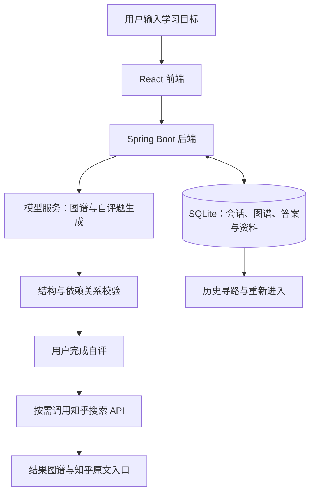

# 知阶 KnowledgeSteps 产品说明计划书

**项目名称：** 知阶 KnowledgeSteps  
**产品定位：** 连接学习目标、前置知识与知乎内容的知识寻路工具  
**产品标语：** 每一个知识，都有它的台阶。  
**演示地址：** https://ksteps.yinbo.online  
**版本说明：** 初审提交稿，基于 2026 年 9 月 13 日项目现状编写；后续规划单独列明。

## 一、项目概述

**想学新知识，先补哪些基础？** 这是知阶希望帮助用户回答的问题。

知阶面向大学生、跨专业学习者和自主学习者。用户输入一个学习目标，系统生成前置知识依赖图，通过简短自评了解用户对各知识点的熟悉程度，再为需要补充的节点匹配知乎学习资料。用户既能看到知识之间的关系，也能直接进入原文阅读，把抽象的学习意愿转化为具体的学习行动。

产品的核心流程是：**明确目标 → 展开前置知识 → 确认已有基础 → 按需推荐资料 → 回看学习路径。**

知阶的个性化依据是用户的学习目标和主动填写的自评，不依赖对其关注列表、收藏或其他个人行为的读取。产品优先解决学习开始时的方向问题，帮助用户少一些盲目搜索，多一些有依据的选择。

## 二、创作思路：从“搜不到”到“不知道该搜什么”

学习复杂概念时，困难往往发生在搜索之前。用户知道自己想理解 Transformer，却不一定知道应该先了解向量、矩阵运算、词向量或注意力机制。直接搜索目标，可能遇到大量尚无法理解的术语；从完整课程开始，又可能重复学习已经熟悉的部分。

与此同时，知乎已经承载了围绕具体问题展开的解释、经验和讨论。对初学者而言，难点在于如何把分散的内容与自己的当前基础连接起来：某篇回答解释了一个重要概念，但用户可能还不知道这个概念与目标之间有什么关系。

知阶由此提出一个设计思路：**先帮助用户发现应该提出的问题，再连接能够回答这些问题的社区内容。**

产品通过知识依赖关系呈现“为什么要学这个”，通过自评减少不必要的推荐，通过原文入口保留作者和内容语境。AI 负责辅助组织知识结构，知乎内容提供进一步理解概念的阅读入口，用户保留判断自身基础和选择阅读材料的主动权。

## 三、典型场景与使用过程

### 3.1 场景示例：准备学习 Transformer 的大学生

一名学生希望理解 Transformer，但不清楚需要哪些基础。他在知阶输入学习目标后，系统生成与目标相关的前置知识图谱，并为前置节点提供自评问题。

假设他对向量与矩阵运算已经熟悉，对词向量仅有概念，对注意力机制尚不了解。提交自评后，图谱仍保留这些节点及其依赖关系，已经熟悉的节点不再推荐资料，其余节点根据熟悉程度展示不同数量的知乎内容。

学生可以沿依赖关系选择需要补充的基础，打开节点查看文章摘要、作者及来源信息，进入知乎阅读完整解释。之后，他能够在历史寻路页面重新进入这次结果，无须再次从头寻找资料。

以上是使用方式示例，实际生成的节点与资料以当次结果为准。

### 3.2 适用人群

| 人群 | 常见需求 | 知阶提供的帮助 |
| --- | --- | --- |
| 大学生与跨专业学习者 | 接触新课程或新领域，不清楚前置要求 | 展开知识关系，找到需要先补充的概念 |
| 自主学习者与开发者 | 为项目学习新技术，希望减少重复学习 | 根据已有基础缩小阅读范围，连接具体资料 |
| 知乎知识内容读者 | 看懂一篇文章需要先理解多个术语 | 将概念放回依赖关系中，辅助持续阅读 |

## 四、核心产品设计

### 4.1 用依赖图解释学习顺序

结果通过节点与连线呈现知识之间的前置关系，帮助用户理解一个概念依赖哪些基础。图谱保留已熟悉节点，让用户看到完整上下文，而不是只剩一份孤立的待学清单。

系统引导模型控制图谱规模，避免首次寻路就产生难以阅读的庞大结构。展示层依据真实依赖关系进行布局，不通过添加虚构连线来调整外观。

### 4.2 用轻量自评控制资料数量

用户逐项选择熟悉程度，系统按以下规则决定推荐上限：

| 用户自评 | 每个前置节点的资料上限 |
| --- | ---: |
| 非常了解 | 0 条 |
| 基本了解 | 2 条 |
| 听说过 | 3 条 |
| 不了解 | 5 条 |

目标节点保留说明，不推荐资料。搜索结果不足或过滤后数量减少时，展示实际结果，不补造文章。自评用于辅助分配阅读材料，不等同于客观考试或掌握程度认证。

### 4.3 用简短摘要连接完整原文

资料卡片展示标题、简短内容、作者、赞同数及接口可提供的日期信息，并提供“在知乎阅读原文”入口。摘要最多 200 字，尽量保留段落关系，支持数学公式展示，便于用户快速判断是否值得继续阅读。

内容来源与作者保持可见。若接口提供的是更新时间，则按对应含义展示，不将其误认为首次发布时间。赞同数作为阅读参考，不作为内容正确性的保证。

### 4.4 用历史寻路保存学习入口

历史页面展示寻路名称、状态、目标描述和创建时间，支持重新进入结果与分页浏览。用户可以确认后永久删除某次寻路及其关联数据，管理自己的历史记录。

## 五、适配知乎社区的场景价值

### 5.1 把学习意图转化为可搜索的问题

许多学习者能够描述目标，却无法准确说出知识缺口。知阶先把目标拆解成具体概念，再围绕需要补充的节点调用知乎搜索，使社区内容出现在更明确的学习情境中。

例如，用户最初输入的是“Transformer”，实际需要阅读的可能是“矩阵乘法如何理解”或“词向量是什么”。这种转化帮助用户走到原本不知道如何检索的内容面前。

### 5.2 为分散的知识内容补充关系

知乎回答和文章通常围绕一个问题或主题展开。知阶为这些阅读入口补充前置关系，让用户理解“这篇内容与我的目标有什么联系”和“阅读之前需要哪些基础”。同一篇解释基础概念的内容，也可能在多个学习目标下被发现。

产品的价值在于按学习需要重新组织内容入口，增加知识内容在具体场景中的可发现性，而非仅提供另一份关键词搜索结果。

### 5.3 保留社区作者的表达与内容语境

理解一个知识点，可能需要不同角度的解释。知乎原文中的推导、例子、实践经验以及讨论，为读者提供进一步判断和理解的空间。

知阶通过有限摘要帮助筛选，并引导用户进入原文继续阅读，保留作者署名与来源链接。预期形成“发现知识缺口—找到相关作者内容—回到知乎深入阅读”的路径。对作者而言，这提供了在相关学习情境中被发现的机会；对社区而言，有助于让既有内容获得与具体需求相匹配的阅读入口。

这些是产品的预期价值，尚未以用户规模、回流量或学习效果数据证明，后续将通过真实试用验证。

### 5.4 以用户主动表达为个性化起点

当前推荐不要求读取用户的关注或收藏。用户只需要说明目标并完成自评，即可获得差异化资料。后续接入知乎 OAuth 登录时，首先用于身份识别与历史记录归属；任何额外个人数据能力都应依据实际需求、接口开放范围和用户授权单独设计。

## 六、技术方案

### 6.1 整体架构

前端采用 React、TypeScript、Vite 与 Ant Design，负责目标输入、自评、图谱交互和资料展示。后端采用 Java 21 与 Spring Boot，通过 SQLite 保存业务数据，使用 Flyway 管理数据库结构变更。线上通过 Nginx 提供 HTTPS 和同源接口代理。

模型使用兼容 OpenAI 协议的远程服务，分别完成图谱与自评题生成，方便根据质量、耗时与成本调整配置。服务器主要承载业务逻辑与数据存储，不在本机运行大模型推理。

### 6.2 对生成结果进行结构校验

模型输出经过后端校验，包括节点标识唯一性、依赖引用合法性、环路、自依赖、节点与目标的可达关系，以及题目对前置节点的覆盖情况。对可修正的异常进行有界纠正，无法得到合法结果时明确反馈失败。

这些检查保障结构可用，但不能替代对知识关系本身的专业判断。后续仍需通过代表性主题审查和用户反馈改进内容质量。

### 6.3 将知识生成与资料检索分开

图谱和题目先生成，用户完成自评后才搜索资料，从而减少对已熟悉节点的不必要请求。资料链接来自知乎搜索结果，避免让模型直接编造阅读来源。

结果保存后可从历史进入。单个节点资料搜索失败时，保留图谱及其他节点结果并给出提示，避免局部失败使整次寻路不可用。

### 6.4 异步处理与基础防护

生成与检索采用异步任务，前端展示任务状态。当前使用 4 个工作线程和有界等待队列，并分别设置 IP、用户速率与用户在途任务限制，避免将工作线程数量误当成完整限流方案。

当前每位用户一分钟内最多成功创建 10 次寻路、最多保留 20 条历史，同时执行的任务最多 2 个；历史满后需删除记录再创建。创建请求支持幂等处理，减少重复点击带来的重复生成。

接口按用户隔离记录，密钥保留在服务端，登录会话采用安全 Cookie 和 CSRF 防护。以上是当前演示规模的基础措施，实际承载能力仍需依据部署环境和上游接口限制持续验证。

## 七、当前成果与实施计划

### 7.1 已实现

目前已实现目标输入、图谱生成与校验、自评、按熟悉程度搜索知乎资料、结果展示、原文跳转、历史回看与永久删除，并已部署演示站点。工程包含前后端自动化验证及限流、任务隔离、请求去重等基础防护。

当前支持 **知乎 OAuth 登录**，已完成线上真实授权验证，用户使用各自的知乎账号建立独立历史记录。管理员登录保留为团队演示入口。

### 7.2 后续计划

| 阶段 | 重点工作 | 验收方式 |
| --- | --- | --- |
| 提交完善阶段 | 基于已接入的知乎 OAuth 整理演示流程和代表性主题 | 验证登录、退出、历史归属及完整寻路流程 |
| 小范围试用阶段 | 邀请目标用户试用，收集缺失节点、错误依赖和不相关资料反馈 | 对典型主题逐项核查，形成可复现问题清单 |
| 体验优化阶段 | 优化图谱规模、搜索表达、失败提示与等待时间 | 比较调整前后的完成率、耗时与资料相关性 |
| 后续探索阶段 | 评估更细粒度的阅读反馈和学习进度能力 | 先验证用户需求，再决定是否扩展功能 |

## 八、效果评价与产品边界

项目将围绕三个问题评价效果：用户能否理解缺少哪些基础、资料是否能帮助其进一步阅读、完整寻路过程是否稳定可用。

具体观察指标包括图谱结构合法率、人工核查的依赖合理性、资料相关性、生成耗时、任务完成率，以及用户是否认为结果帮助自己明确了下一步。原文点击等行为只能说明用户产生阅读兴趣，不能直接证明其掌握了知识。当前不预设已取得的学习提升或社区增长数据。

产品也存在明确边界：模型可能遗漏或误判前置关系，用户自评可能偏差，知乎搜索结果受可用内容及接口影响。知阶提供的是辅助学习导航，适合帮助用户确定起点和寻找资料；更深入的学习仍需要结合完整原文、课程、实践与自主判断。

**知阶希望让知乎内容在用户“刚好需要理解它”的时刻被发现，让一个学习目标，拥有可以逐步走上去的知识台阶。**
