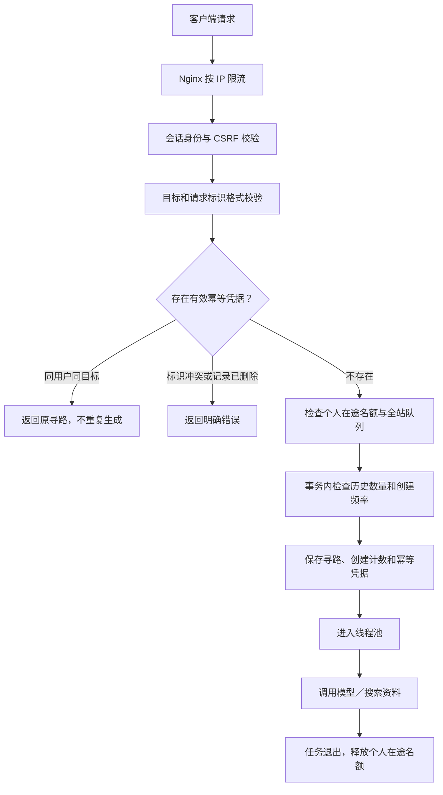

# 知阶防护策略

更新日期：2026-09-13。本文描述仓库当前实现及发布边界，不代表已完成全面安全审计或攻击测试。

## 1. 适用范围与当前状态

适用于单实例后端、SQLite、同域 Nginx 反向代理的部署方式。公开使用计划通过知乎 OAuth 登录，按授权用户对应的内部 userId 执行规则；当前仓库的正式 OAuth 流程尚未接通，现有演示站点使用管理员账号。

| 项目 | 本地代码／配置 | 当前线上状态 |
| --- | --- | --- |
| 登录身份、CSRF、按用户访问寻路 | 已实现 | 已部署管理员会话版本 |
| 全站工作线程 | 默认 4，等待队列 8 | 已部署 4 个线程、队列 8 |
| Nginx IP 限流 | 配置已准备，nginx -t 验证通过 | 已部署，短时突发测试验证 429 |
| 每用户创建频率、历史数量限制 | 已实现，数据库 V6 | 已部署 |
| 每用户在途任务、幂等创建 | 已实现，数据库 V7 | 已部署 |
| 模型 HTTP 429 退避重试 | 已实现并通过模拟响应测试 | 已部署 |
| 每日预算 | 按产品要求不设置 | 不设置 |

“代码已实现”不等于正在运行的本地进程已经加载新代码；后端需构建、重启并完成迁移后生效。后续发布时需同步更新此表。

## 2. 防护分层

三种限制不能互相替代：IP 限制保护入口，用户限制保证公平与控制单用户行为，线程池限制后台同时执行任务的数量。线程池满时仍会有请求到达 Web 服务，因此不能仅靠工作线程数保护入口。

## 3. Nginx 按 IP 限流

配置位置：[ksteps-https.conf](../deploy/ksteps-https.conf)。文件从 Nginx 的 `http` 上下文加载，`map` 和 `limit_req_zone` 不能放入 `server` 内。

| 请求范围 | 漏桶速率 | 额外突发额度 |
| --- | --- | --- |
| 所有 `/api/` 请求 | 20 次／秒／IP | 40 |
| `POST /api/v1/learning-sessions` | 60 次／分钟／IP | 20 |
| `POST /api/v1/auth/admin/login` | 5 次／分钟／IP | 5 |

创建和登录请求同时受普通 API 规则限制。`nodelay` 允许额度内的突发请求立即通过，超出后返回 429；这些是漏桶速率，不是严格的“任意一分钟内只通过 N 次”。后端每用户 10 次规则使用严格的滚动窗口。

静态页面、JS、CSS、字体和 HTTP 证书验证不计入这些限流区。Nginx 拒绝时返回 JSON 错误 `IP_RATE_LIMITED`、`Retry-After: 60` 和禁止缓存头；此处 60 秒是统一重试建议，不是精确解禁倒计时。

当前服务器直连，按 `$binary_remote_addr` 识别连接来源。校园、公司、家庭网络可能多人共用公网 IP，因此入口阈值高于单用户阈值。今后启用 CDN 或 Cloudflare 代理，必须先配置可信代理地址范围及真实 IP 恢复；不能直接信任客户端任意提交的 `X-Forwarded-For`，否则可能被伪造绕过或把全部用户算成同一 IP。

Nginx 限流不是容量型 DDoS 防护，无法阻止链路带宽在请求到达应用前被耗尽。

## 4. 每用户创建频率

**每个用户在滚动 60 秒内最多成功创建 10 条寻路。**

- 身份取自已验证会话，不使用请求体中的 userId。
- 只有实际创建记录成功才增加计数，模型稍后失败不会返还该次数。
- 参数错误、未登录、CSRF 失败、历史满额、在途满额、全站队列满等拒绝请求不新增计数。
- 幂等回放不增加计数。
- 删除历史不返还这 60 秒内的创建次数。
- 创建计数持久化，重启服务不会清空当前时间窗口。

第 11 次创建返回 HTTP 429，错误码 `USER_CREATE_RATE_LIMITED`，`Retry-After` 为最早一次计数离开窗口的剩余秒数，至少 1 秒。

V6 的 `session_creation_events` 只记录用户与创建时间，不记录目标内容。创建事务清理过期计数；没有后台定时清理器，因此过期行可能暂时物理保留，但不再计入窗口。并发检查在 SQLite 写锁保护下执行，与寻路插入一起提交或回滚，不能通过并发请求突破阈值。

## 5. 历史寻路数量限制

**每用户最多保留 20 条寻路，按数据库中实际存在的记录数统计。**

所有状态都计入，包括生成中、等待作答、已完成及失败记录。旧账号已有超过 20 条时，不自动删除历史，但不能创建新记录，必须先删到少于 20 条。

满额返回 HTTP 409、`SESSION_LIMIT_REACHED`，提示：

> 最多保留20条寻路，请先在历史寻路中删除记录后再试。

删除由用户确认后执行硬删除：图谱节点与边、问卷、答案、推荐资料及寻路主记录在同一事务中删除；任一步失败则整体回滚。用户只能删除自己的记录。删除后释放历史名额，但新建请求仍需通过频率和在途限制。

该限制不是累计使用次数上限，也不是金额上限。用户可以删除旧记录后继续使用，符合目前不设置每日预算的产品决定。

## 6. 每用户在途任务限制

**每个用户最多同时占用 2 个后台任务位置，执行中和排队中合计。**

图谱与问卷生成视为一个任务；答题后的资料搜索也占一个任务位置，并与生成共用个人上限和全站线程池。问卷已经 READY、仅等待用户作答时不占后台位置。

超限返回 HTTP 429、`USER_TASK_LIMIT_REACHED`，提示等待已有任务完成。一个用户不能独占全站四个执行线程。

计数绑定实际提交的后台任务，而不是历史记录数量：删除正在运行或排队的寻路不会提前释放位置；任务实际退出后，通过 finally 释放，包括正常完成和异常退出。线程池拒绝提交时也释放刚预留的位置。对已经在搜索中的任务重复提交完成请求，不重复加入队列。

此计数是单实例内存状态；重启时旧生成任务按现有恢复流程标为中断，资料搜索按既有恢复规则处理。若未来扩展为多个后端实例，需要重做跨实例在途控制，不能认为当前计数天然全局有效。

## 7. 全站容量控制

| 配置 | 当前本地值 |
| --- | --- |
| 工作线程 | 默认 4，可通过 `GENERATION_WORKERS` 设置为 1–32 |
| 等待队列 | 8 |
| 实际执行与排队的理论总容量 | 12 |

个人规则同时生效，因此单个用户最多占其中 2 个位置。全站容量不足返回 429 `RATE_LIMITED`，建议 5 秒后重试。

队列满前检查避免通常情况下先建记录再拒绝任务；提交与服务关闭等特殊竞争导致执行器拒绝时，将已创建任务标记中断并返回繁忙。模型请求和网络等待发生在数据库事务之外，避免长时间占用 SQLite 写锁。

增加线程数不会提高外部模型账户的限额，也不保证减少所有请求的等待时间。四线程配置需要结合服务器资源、模型延迟和错误率评估。

## 8. 幂等创建与前端防重复提交

创建接口支持 `Idempotency-Key` 请求头，格式为 8–128 个 ASCII 字母、数字或 `._:-`。新前端使用 UUID。

| 情况 | 行为 |
| --- | --- |
| 同用户、同标识、同目标，在 24 小时内重试 | 返回原 sessionId 和当前状态，不再次生成 |
| 同标识换了目标 | 409 `IDEMPOTENCY_CONFLICT` |
| 原寻路已被删除 | 410 `IDEMPOTENCY_DELETED`，不偷偷重新创建 |
| 不同用户使用相同标识 | 互不影响 |
| 标识不合法 | 400 `INVALID_IDEMPOTENCY_KEY` |
| 没有提交该请求头 | 兼容旧客户端，但没有幂等保证 |
| 超过 24 小时 | 不再保证回放旧请求，可作为新创建处理 |

幂等查询先于用户容量与全站队列检查，因此达到上限后，合法重试仍能取回原结果。凭据由 V7 的 `session_creation_keys` 保存，包含用户、请求标识、目标 SHA-256、时间与原寻路引用，不保存目标原文。硬删除后引用置空，保留短期删除凭据；后续创建清理过期凭据。

前端使用同步提交锁防止同一页面连续双击。一次提交因网络异常失败后，在该页面重试相同目标沿用原标识；成功后清除，目标改变时换新标识，原记录已删除时下一次点击也换新标识。

当前前端标识保存在页面内存中，刷新页面或不同标签页会生成新标识，不能据此承诺跨页面自动去重。后端防重复依据请求标识，不会因为两个独立请求的目标名称相同就合并它们。

## 9. 模型接口 429 退避

仅对模型 HTTP 429 启用新的传输重试，每次模型调用最多追加 2 次请求，即最多 3 次尝试。

1. 第一次被限流默认等待 1 秒，第二次默认等待 2 秒。
2. 每次额外加入 250–750 毫秒随机延迟，减少多个线程同时重试。
3. 识别上游 `Retry-After` 秒数或 HTTP 日期，不提前重试。
4. 上游要求等待超过 30 秒时，直接报告繁忙；不截短要求后继续请求。
5. 重试耗尽后记录 `MODEL_RATE_LIMITED`，向用户显示模型服务繁忙。
6. 线程中断会终止等待并保留中断状态；不无限循环。

等待期间仍占工作线程和个人在途名额。401、非 429 错误不因这项策略自动重试。原本针对内容校验失败的一次修复调用仍独立存在；每次修复调用也可能遇到有限的 429 重试，所以“三次”不是整个寻路流程的最大模型调用次数。

这是单请求退避，不是全站上游熔断器或模型账户的精确 RPM/TPM 配额控制。知乎搜索保留其已有重试逻辑，不应把模型 429 策略误认为已经统一覆盖所有上游服务。

## 10. 身份、数据与部署基础保护

- 业务请求从服务端会话读取身份；读取、修改和删除寻路均校验所属用户。雪花 ID 不是访问凭证，也不能代替权限检查。
- 写接口验证 CSRF Token，登录成功后失效旧会话、建立新会话。Cookie 为 HttpOnly、SameSite=Lax；线上 `admin-login` 配置要求 Secure Cookie，必须使用 HTTPS。
- 管理员密码使用带盐 PBKDF2-HMAC-SHA256 校验，迭代 600,000 次，不把明文密码写入数据库。
- 当前管理员登录还存在单实例全站每分钟 10 次尝试的保护。多人共享该账号时共用身份、历史和所有用户配额；这不能替代独立 OAuth 用户登录。
- 正式部署不启用 `local-test` 身份旁路；配置禁止其与管理员登录同时开启。
- 后端只监听服务器回环地址，Nginx 代理 `/api/`；密钥仅存服务端私密配置，不放入前端 VITE 配置或代码库。
- systemd 以独立服务用户运行，数据库目录单独允许写入，并配置异常重启。请求体在当前 Nginx 配置中限制为 1 MiB。

## 11. 主要返回信息

| HTTP | 错误码 | 用户处理方式 |
| --- | --- | --- |
| 429 | IP_RATE_LIMITED | 当前网络请求过多，稍后再试 |
| 429 | USER_CREATE_RATE_LIMITED | 等待创建频率窗口恢复 |
| 429 | USER_TASK_LIMIT_REACHED | 等待正在执行或排队的任务退出 |
| 429 | RATE_LIMITED | 全站队列繁忙，稍后再试 |
| 409 | SESSION_LIMIT_REACHED | 删除自己的历史记录后再试 |
| 409 | IDEMPOTENCY_CONFLICT | 为新的目标发起新请求标识 |
| 410 | IDEMPOTENCY_DELETED | 原记录已删除，需要显式重新创建 |
| 400 | INVALID_IDEMPOTENCY_KEY | 修正请求标识 |
| 429 | LOGIN_RATE_LIMITED | 等待管理员登录窗口恢复 |
| 401／403 | 身份或 CSRF 错误 | 重新登录或刷新获取有效会话 |

`MODEL_RATE_LIMITED` 是异步任务的失败原因，通常通过查询任务状态看到，不表示最初创建接口必然同步返回 HTTP 429。

## 12. 验证与发布检查

当前验证基线：139 项后端测试、17 项前端回归测试通过，前端 lint、typecheck、build 通过。覆盖了并发限额、删除后频率不重置、幂等并发只创建一次、跨用户隔离、删除运行任务不能绕过在途限制、搜索共用上限、退避停止及中断行为。新增退避通过模拟上游响应测试，没有人为向真实供应商刷请求制造 429。

Nginx 配置通过 `nginx -t`，已在线启用；80 次短时请求中 47 次返回未登录的 401，33 次被入口限流为 429，并验证 JSON 错误码与 Retry-After。此前的单用户四并发压测发生在个人在途限制加入之前，不代表新规则允许单用户四并发。

发布时检查：

- 备份 SQLite，构建并一起发布前后端，确认 Flyway V6、V7 应用成功。
- 使用生产身份配置，确认没有开启测试身份旁路，模型密钥不进入前端产物。
- 检查 Nginx 配置后重载，核对可信代理与真实 IP 策略，再验证 429 的 JSON 和 Retry-After。
- 用独立测试用户检查第 3 个在途任务、第 11 次创建、第 21 条历史的拒绝行为。
- 验证删除释放历史名额、幂等重试不重复生成，并确认正常用户仍可访问。
- 观察队列拥塞、模型 429、任务失败率、请求耗时与内存。本文未宣称已经部署自动告警。

本轮不增加每日预算。也尚未提供分布式限流、全局模型熔断、容量型 DDoS 防护；当前全站管理员登录尝试额度仍可能被单个来源耗尽。正式 OAuth 接入还需单独验证授权回调、state、凭据处理和账号绑定，不能仅凭当前会话校验认定 OAuth 已安全上线。

## 13. 实现入口

| 文件 | 职责 |
| --- | --- |
| [Nginx 配置](../deploy/ksteps-https.conf) | IP 限流、429 响应和同源代理 |
| [LearningSessionService](../backend/src/main/java/com/zhihu/hackathon/session/LearningSessionService.java) | 个人在途、全站队列和幂等回放入口 |
| [JdbcSessionStore](../backend/src/main/java/com/zhihu/hackathon/session/JdbcSessionStore.java) | 事务内创建配额与幂等持久化 |
| [V6 迁移](../backend/src/main/resources/db/migration/V6__session_creation_limits.sql) | 短期创建计数 |
| [V7 迁移](../backend/src/main/resources/db/migration/V7__session_creation_keys.sql) | 幂等凭据 |
| [ModelRateLimitBackoff](../backend/src/main/java/com/zhihu/hackathon/session/ModelRateLimitBackoff.java) | 模型 429 的延迟与等待上限 |
| [HomePage](../frontend/src/pages/HomePage.tsx) | 同步提交锁与前端请求标识 |
| [API 约定](API_CONTRACT.md) | 完整接口和错误响应 |
| [部署说明](DEPLOYMENT.md) | 发布、运行配置及线上状态 |

### 2026-09-13 线上发布验收

已发布至 https://ksteps.yinbo.online ，数据库 V1–V7 迁移成功。发布前 10 条历史完整保留，验证新增 2 条寻路。两个 Gemini 任务均 READY，其中一个答题后 COMPLETED 并获得 3 条知乎资料。线上验证同用户第 3 个在途请求返回 USER_TASK_LIMIT_REACHED，重复标识回放原 sessionId 且总历史只增加 2 条。10 次／分钟及 20 条历史边界沿用自动化测试证据，没有通过大量真实模型请求刷满线上账号来验证。后端内存当时约 192 MiB，NRestarts=0。

回滚备份位于服务器 `/var/backups/knowledgesteps/release-20260912T185821Z`，含发布前数据库、后端、前端及配置，仅管理员可读。OAuth 仍未接通，演示站点继续使用原管理员账号。
